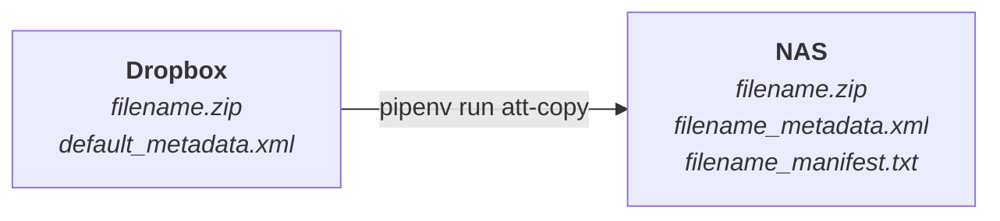

# Interim ATT Copy Tool

A Python CLI application for moving content from Dropbox to the Synology NAS in a secure and validated manner, acting as part of the interim replacement for the prior Archive Transfer Tool.

## Pre-Requisites

This depends on

* The existence of a Dropbox Team Folder named `ArchivesTransfer` (configured by IS&T in the MIT instance of Dropbox for MIT Libraries)
* The existence of a Dropbox App that provides access to this Team Folder via the Dropbox API (see [Dropbopx Apps](https://www.dropbox.com/apps) and [Dropbox Developers](ttps://www.dropbox.com/developers/apps))
* The NAS-hosted `cdps-processing` share mounted on the local workstation
* Python 3.12, `pip`, and `pipenv` installed on the local workstation

## Opinionation

This application is very opinionated on the the source/target locations:

* The remote (e.g., the source file) must be in Dropbox
* The local (e.g., the target file) must be on a mapped/mounted drive on the local workstation

## Requirements

1. You must mount/map the NAS share (authenticated as yourself) before running the application.
1. Authentication to Dropbox will be an interactive prompt from the application.

### Environment Variables

The following local environment variables must be set

* `WORKSPACE`: this should be `dev` for development work and `prod` otherwise
* `DROPBOX_FOLDER`: this should be set to the absolute "path" for the Dropbox Team Folder name. For example, `/DropboxTeamFolder/` (yes, it needs both the leading and trailing forward slashes, and it is **always** formatted this way, regardless of whether this app is running on Windows, macOS, or Linux)
* `NAS_FOLDER`: this should be set to the full path to the `ATT` folder on shared storage. On Windows, this will look like `H:\<att_folder_name>\` while on macOS/Linux it will look like `/path/to/<att_folder_mame>\` (yes, it needs the trailing slash/backslash)
* `DROPBOX_APP_KEY`: This is the key that is found in the Dropbox Developers page for the Dropbox App that provides authenticated API access to the Dropbox Team Folder. This will be shared with users via LastPass.

If you use the instructions below to run the app (e.g., `pipenv run ...`) the easiest way to set the local environment variables is to create a `.env` file at the root of this project, with the following:

```env
WORKSPACE=prod
DROPBOX_APP_KEY=<key_from_dropbox_developers_app_interface>
DROPBOX_FOLDER=/ArchivesTransfer/
NAS_FOLDER=/Volumes/cdps-processing/ATT/
```

The `NAS_FOLDER` is operating system specific. That is, if you are running this on Windows, it will look something like

```env
NAS_FOLDER=Y:\ATT\
```

The `.gitignore` file explicitly lists the `.env` file, so it should never get captured in a commit.

## How to use this application

This is an interactive Python CLI application. Download the repository from GitHub and configure your local environment variables (see above). Then,

```bash
make install
```

to get your dependencies installed in a virtual environment.

### Simple environment check

Run

```bash
pipenv run att check
```

to verify that the application can reach out to Dropbox and that the application can reach out to the NAS.

### Single file copy

Run

```bash
pipenv run att [--verbose] [--overwrite] single-file-copy --remote-file "<relative_path_to_remote_file>"
```

to process a file that exists in Dropbox so that a checksum-validated copy of that file will be copied to the `ATT` folder in the `cdps-processing` share on the Synology along with an associated metadata file.

### Bulk file copy

Run

```bash
pipenv run att [--verbose] [--overwrite] bulk-file-copy --remote-csv "<relative_path_to_remote_csv_file>"
```

to process a `.csv` that contains a list of files that exist in Dropbox so that checksum-validated copies of all the files listed in the `.csv` will be copied in the `ATT` folder in the `cdps-processing` share on the Synology along with a file-specific metadata files with additional data from the `.csv`.

## What this application does

The application performs a few steps for the user to remove some of the drudgery of file copying.

1. It copies a single file from a folder in Dropbox to a folder on the NAS.
1. It verifies that the Dropbox SHA256 stored in the Dropbox metadata matches the Dropbox-style SHA256 of the copied file on the NAS
1. It copies the default metadata file from the folder in Dropbox and saves a copy next to the file on the NAS
1. It generates a new, standard SHA256 for the file on the NAS and stores that in a manifest `.txt` file next to `.zip` file on the NAS.



## Development

* To preview a list of available Makefile commands: `make help`
* To install with dev dependencies: `make install`
* To update dependencies: `make update`
* To run unit tests: `make test`
* To lint the repo: `make lint`
* To run the app: `pipenv run att --help`
